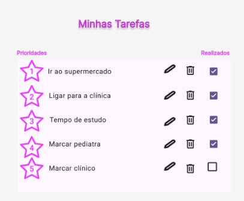
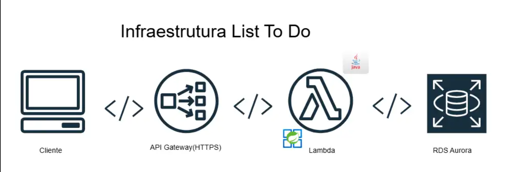

# Desafio Final: Sistema de Gerenciamento de Tarefas (To Do List) – Projeto Catalisa

## Problematização

No projeto Catalisa, os participantes enfrentam desafios para organizar e acompanhar suas tarefas ao longo das etapas do programa. A ausência de um sistema centralizado dificulta o controle de prazos, o acesso a materiais e a comunicação eficiente entre alunos e professores, especialmente no acompanhamento de atividades e feedbacks.

**Solução:**  
Desenvolver uma aplicação web de gerenciamento de tarefas que permita criar, editar, concluir e acompanhar tarefas, anexar arquivos e receber notificações automáticas, promovendo organização durante todo o projeto.

---

## Processo e Desenvolvimento

- **Arquitetura em Camadas:**  
  O projeto é estruturado em camadas (Controller, Service, Repository, DTO, Exception, Infra e Model), separando claramente as responsabilidades.

- **Aplicação de SOLID:**  
  Os princípios SOLID são aplicados principalmente nas camadas de Service e Repository, garantindo um código limpo, modular e de fácil manutenção.

- **Testes Unitários:**  
  Implementação de testes unitários para regras de negócio e controllers utilizando JUnit.

- **Banco de Dados:**
    - **Produção/Desenvolvimento:** PostgreSQL
    - **Testes Automatizados:** H2

- **AWS:**
    - **Deploy:** API Gateway
    - **Armazenamento de Anexos:** S3
    - **Notificações:** SNS (Simple Notification Service)
    - **API Gateway, RDS, Lambda:** Integração para escalabilidade e automação

- **CI/CD:**
    - **Testes Automatizados:** GitHub Actions
    - **Deploy Automático:** GitHub Actions

- **Swagger:**
    - **End-points:** Swagger 
---

## Pré-requisitos

Antes de começar, certifique-se de ter os seguintes itens instalados em sua máquina:

- [Java 17+](https://www.oracle.com/java/technologies/javase-downloads.html)
- [Maven 3.8+](https://maven.apache.org/download.cgi)
- [Postgres 16+](https://www.postgresql.org/download/)

---

## Protótipo e Stack Utilizada

- **IDE:** Intellij
- **IA:** StackSpot AI
- **Containers:** Podman
- **CI/CD:** GitHub Actions
- **End Points:** Thunder Client e Swagger

---
## Backend

- **Linguagem:** Java (Spring Boot, Lombok, Spring Data JPA, Validation, Maven)
- **Banco de Dados:** PostgreSQL, H2 (testes)
- **Testes Unitários:** JUnit e Jacoco
- **AWS:** S3, API Gateway, RDS, Lambda

---
## Estrutura do Projeto

---
## Funcionalidades

- Criar, editar, concluir e excluir tarefas
- Anexar arquivos às tarefas
- Histórico de atividades realizadas
- Notificações automáticas (SNS ou e-mail) conforme preferência do usuário
- Registro automático do progresso do participante

---
## Documentação Swagger
A aplicação possui uma documentação interativa das APIs gerada pelo Swagger Automagicamente.

Certifique-se de que a aplicação está rodando.
Abra o navegador e acesse:

http://localhost:8080/swagger-ui.html

Na interface do Swagger, você pode:

Visualizar todas as rotas disponíveis.
Testar as APIs diretamente na interface.

---
## Conclusão

Após a conclusão do checklist de uma tarefa, o sistema registra automaticamente o progresso do participante, atualizando o histórico de atividades realizadas.  
Para garantir que o usuário esteja sempre informado sobre o andamento de suas tarefas, é enviada uma notificação automática (via SNS ou e-mail, conforme preferência cadastrada), confirmando a conclusão da tarefa e facilitando o acompanhamento do desempenho ao longo do projeto.

---

## Como Contribuir

1. Faça um fork deste repositório
2. Crie uma branch para sua feature (`git checkout -b feature/nome-da-feature`)
3. Commit suas alterações (`git commit -m 'feat: nova feature'`)
4. Push para a branch (`git push origin feature/nome-da-feature`)
5. Abra um Pull Request

---

## Autores

- **Erica Moraes Abdao** (Dev)
- **Jaqueline Sobral** (Dev)
- **Kaio Gabrioti** (PO)
